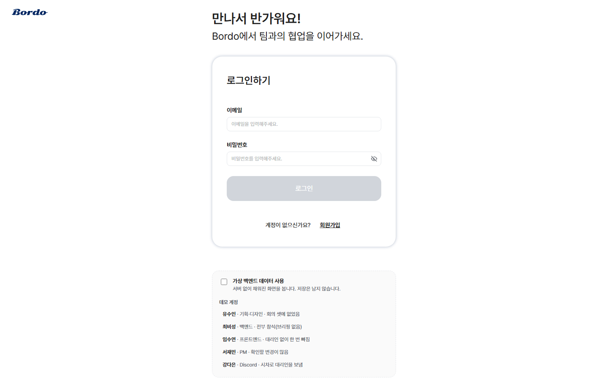
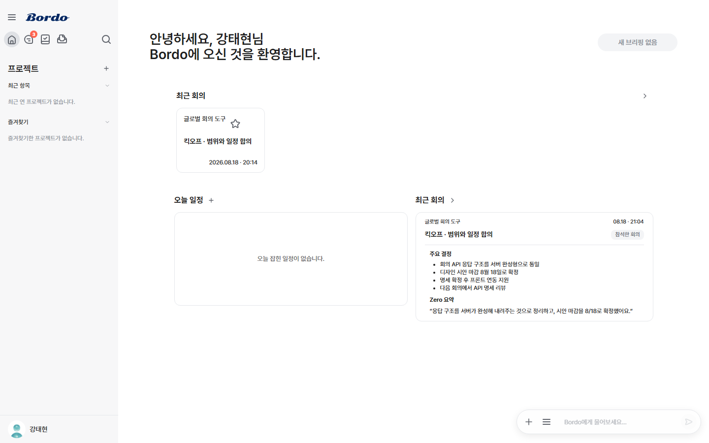
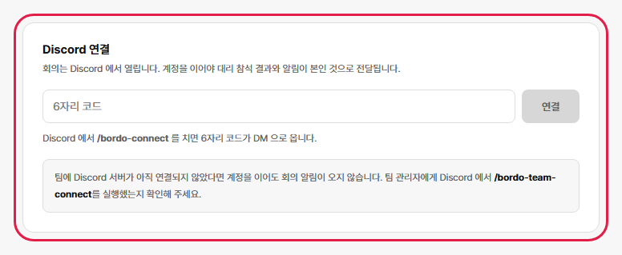
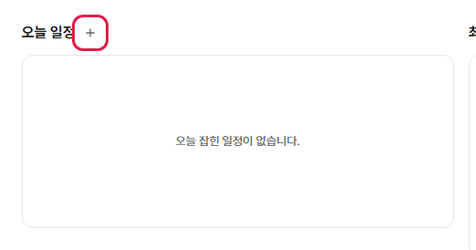
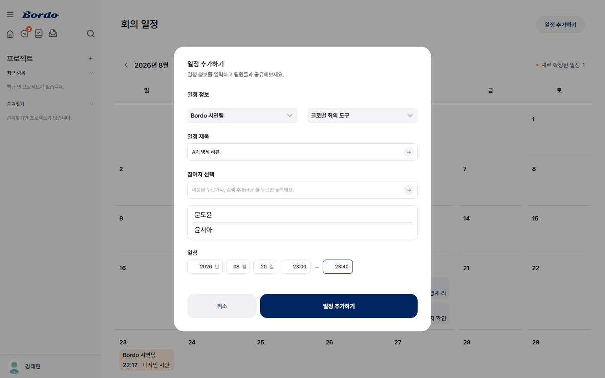
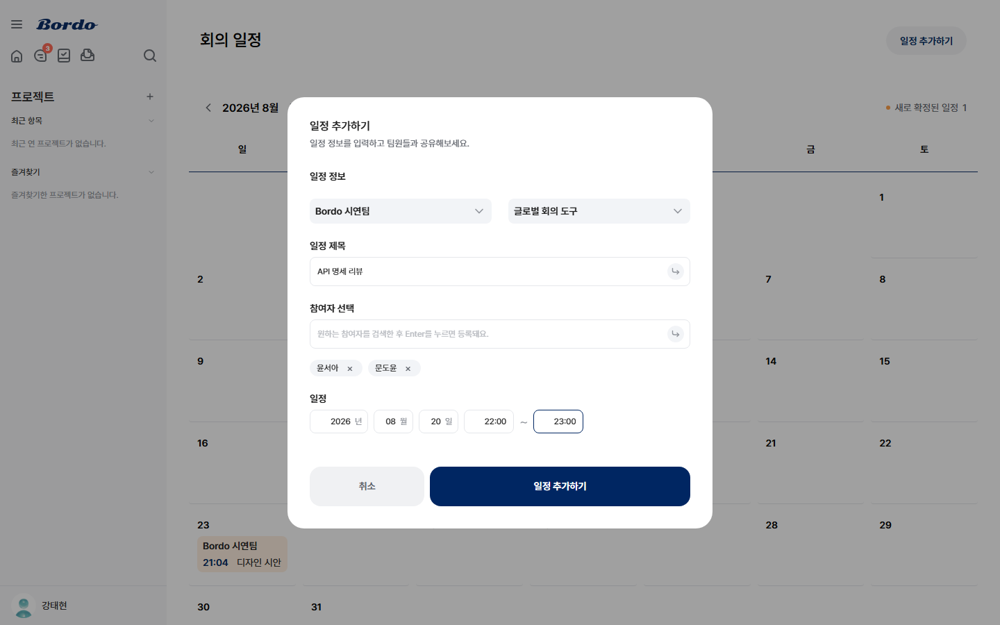
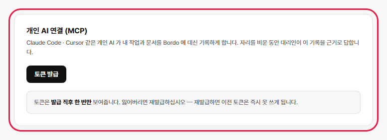
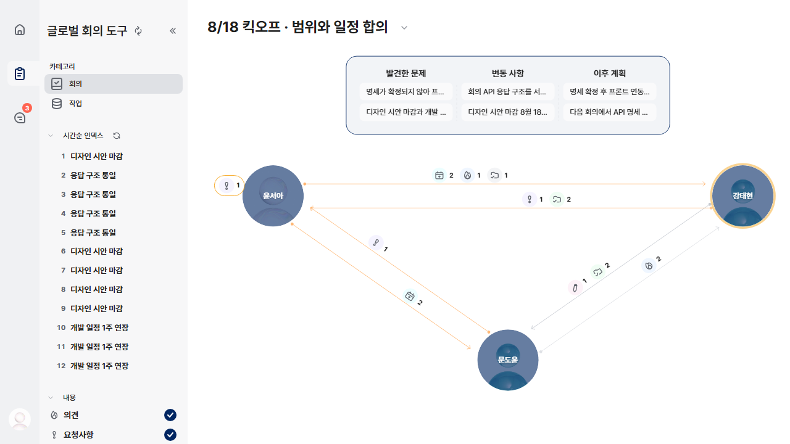
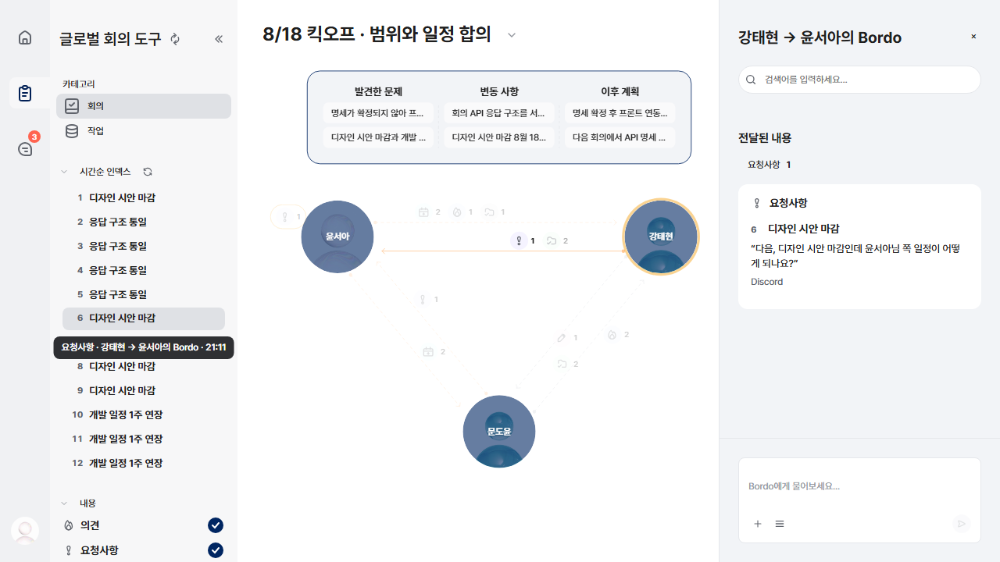

# 시연 시나리오

영상 촬영용 진행 순서입니다. **위에서부터 그대로 따라 하면 됩니다.**
데이터는 `manage.py seed_showcase` 가 깔고, **회의와 Discord 연결은 촬영 중에
직접 합니다** — 둘 다 찍어야 하는 장면이라 시드가 미리 해 두면 그 장면이 없어집니다.

## 타임라인 (약 4:05)

제출 영상은 **길이 제한이 없습니다**(100MB 상한뿐). 화면 녹화는 압축이 잘 먹어
1080p30 · H.264 CRF 21 이면 6분까지도 100MB 안에 들어옵니다. 그래서 2:20 으로
눌러 담지 않고, 기획서의 네 단계(회의 전 · 중 · 직후 · 전달 후)를 다 담습니다.

| 시간 | 장면 | 누구 |
|---|---|---|
| 0:00-0:12 | 문제 — 국기 셋, 시차 | (화면 없음) |
| 0:12-0:22 | **로그인** → 홈 | 강태현 |
| 0:22-0:42 | **Discord 연결** — DM 코드 → 웹 입력 → 서버 연결 | 강태현 |
| 0:42-0:52 | 회의를 만든다 `API 명세 리뷰` | 강태현 |
| 0:52-1:05 | 자리를 비운다 — **불참 등록** | 윤서아 |
| 1:05-1:15 | **한 명 더 자리를 비운다** — 불참 등록(배속) | 문도윤 |
| 1:15-1:30 | 회의 전 — 예상 논쟁점(**AI 가 뽑아 준 것**) · 공개 스위치 | 윤서아 |
| 1:30-1:50 | **기록은 어디서 오나** — 개인 AI 에서 MCP 로 작업 기록 | 윤서아 |
| 1:50-2:25 | Discord 회의 — **대리인 둘이 답한다. 답변 둘 · 유보 하나** | 강태현 혼자 |
| 2:25-2:50 | 플로우 + AI 가 읽은 근거 | 아무나 |
| 2:50-3:15 | **복귀 브리핑 → 답변 대기 질문에 답한다** | 윤서아 |
| 3:15-3:35 | 그 답이 **상대에게 가 있다** — 강태현의 `윤서아의 Bordo` 방 | 강태현 |
| 3:35-4:05 | 마무리 — 지난 회의 · 일정 · 문서 배속 | — |

굵은 것 다섯이 이 영상의 뼈대입니다. **잘라야 하면 앞에서 자르십시오** —
0:22-0:42(Discord 연결)와 1:15-1:30(회의 전 준비)이 먼저입니다. 2:50 이후는
건드리지 마십시오.

> ## Discord 계정이 하나여도 됩니다 — **대리인을 둘 돌립니다**
>
> 윤서아(미국)와 문도윤(베트남)이 **둘 다** 자리를 비우고, 회의에는 강태현
> 한 사람만 들어갑니다. 스레드는 **사람 1 + 대리인 2** 가 됩니다.
>
> 이게 인트로와도 맞습니다 — 국기 셋을 띄워 놓고 "한국만 깨어 있는 시각" 이라
> 말했으면, 회의에 한 명뿐인 것이 오히려 그 상황입니다.
>
> 기능상으로도 안전합니다. 대리인 발언으로는 **다른 대리인을 깨우지 않고**
> (무한 대화 차단), 대상 판정은 발언 하나에 한 명만 고릅니다 — 이름을 넣어
> 물으면 그 사람의 대리인만 답합니다.

> **1:15-1:30 은 위험한 15초입니다.** 예상 논쟁점 화면이 길게 나오면 관객은
> "회의 전에 뭘 잔뜩 써 두는 도구" 로 이해합니다. **채우는 장면을 찍지 말고**,
> AI 가 이미 뽑아 둔 것을 스크롤로 지나가며 반드시 이렇게 말하십시오 —
> "이건 **대리인이 미리 뽑아 준 것**이고, 손대지 않아도 평소 기록만으로 답합니다."
> D절 「이 시연이 증명하려는 것 하나」가 이 한 마디에 걸려 있습니다.

## A. 촬영 직전에 반드시 — 초기화

```powershell
cd d:\Develop\GitHub\backend
.venv\Scripts\python -X utf8 manage.py seed_showcase --reset
```

**Discord 연결 장면(0:22)을 찍으려면 연결이 안 된 상태여야 합니다.** 리허설로
한 번 이어 두었다면 이걸 돌려서 지우십시오. 계정을 지웠다 다시 만들기 때문에
Discord 연결도 같이 사라집니다.

끝에 찍히는 `[주의] Discord 값이 비어 있습니다` 는 **정상입니다** — 그게 곧
"연결 장면을 찍을 준비가 됐다" 는 뜻입니다.

브라우저도 **로그아웃하거나 시크릿 창**을 여십시오. 로그인 장면(0:12)을 찍어야
하는데 토큰이 남아 있으면 홈으로 바로 들어갑니다.

---

## B. 점검 — 하나라도 비면 대리인이 조용합니다

**백엔드 · 프론트 · 봇은 개발 담당이 미리 띄워 두고 살아 있는지까지 확인합니다.**
촬영하는 사람이 터미널을 열 일은 없습니다 — 브라우저와 Discord 만 있으면 됩니다.

촬영하는 쪽에서 볼 것은 하나뿐입니다.

| 확인할 것 | 확인 방법 | 아니면 생기는 일 |
|---|---|---|
| **지금이 한국 시간 16:00~24:00 인가** | 시계 | 아래 「시간대」 참고. 아니면 장면 0:52 가 막힙니다 |

화면이 안 뜨거나 대리인이 조용하면 맨 아래 「대리인이 조용할 때」 로 가십시오.
고칠 사람은 개발 담당입니다.

개발 노트북에서 찍으면 `CELERY_TASK_ALWAYS_EAGER=1` 이라 Redis 없이 돕니다.
대신 대리인 실행이 봇의 HTTP 요청 스레드 안에서 일어나 응답이 몇 초 늦습니다 —
**회의 발언 사이에 한 박자 여유**를 두고 말하십시오.

---

## C. 등장인물

| 계정 | 이름 | 시간대 | 역할 |
|---|---|---|---|
| `taehyun@demo.bordo.dev` | 강태현 | 🇰🇷 `Asia/Seoul` | 진행자 · 팀 OWNER · 회의를 만드는 사람 |
| `seoa@demo.bordo.dev` | 윤서아 | 🇺🇸 `America/Los_Angeles` | **자리를 비우는 사람.** 대리 참석 · 복귀 브리핑 |
| `doyun@demo.bordo.dev` | 문도윤 | 🇻🇳 `Asia/Ho_Chi_Minh` | **자리를 비우는 사람 둘째.** 대리 참석 |

비밀번호는 전부 `Bordo!2026` 입니다.

**회의에 들어가는 사람은 강태현 하나입니다.** 윤서아와 문도윤은 둘 다 자리를
비우고 대리인을 보냅니다. 대리인은 Discord 에 별도 계정으로 들어오지 않습니다 —
BordoBot 하나가 `윤서아의 Bordo` · `문도윤의 Bordo` 두 이름으로 말합니다.
그래서 Discord 화면은 **사람 1 + 봇 1(이름 둘)** 입니다.

Discord 계정이 하나뿐이어도 이 구성이면 됩니다. 대리인끼리는 서로를 깨우지
않으므로(대리인 발언은 판정 대상에서 빠집니다) 스레드가 저희들끼리 떠드는
상태로 흘러가지 않습니다.

**각자에게 근거가 있습니다.** 둘 중 하나라도 기록이 비면 그 대리인은 유보만
하게 되고, 화면에 「관련 기록을 찾지 못해」가 뜹니다.

| 사람 | 작업 | 계획 |
|---|---|---|
| 윤서아 | 회의 상세 화면 최종 시안 · 70% · 브리핑 패널만 남음 | 디자인 시안 8/18 확정 |
| 문도윤 | 플로우 화면 컴포넌트 연결 · 30% · **막힘: 응답 구조 확정 대기** | 명세 확정 다음 날 연동 시작 |

### 시간대 — 한국 시간 16:00~24:00 에 찍으십시오

시간대를 셋으로 벌린 것은 인트로의 국기 셋과 화면이 맞물리게 하기 위해서입니다.
참여자별 현지 시각은 서버가 사람마다 환산해 내려주므로 회의 카드와 채팅방 머리에
실제로 다른 시각이 찍힙니다.

대신 **날짜 경계**가 생깁니다. 홈의 「오늘 일정」은 보는 사람의 시간대로 하루를
자르는데, 한국 오전에 회의를 잡으면 LA 에서는 **전날**이라 윤서아 홈에 그 회의가
안 뜨고 **불참 등록 버튼도 없습니다.**

```
한국 20:00  =  LA 04:00 (같은 날)  =  베트남 18:00 (같은 날)   ← 안전
한국 10:00  =  LA 18:00 (전날)                                  ← 장면 0:52 막힘
```

지금 각자 몇 시인지는 이렇게 확인합니다.

```powershell
cd d:\Develop\GitHub\backend
.venv\Scripts\python -X utf8 -c "import os,django,zoneinfo;os.environ.setdefault('DJANGO_SETTINGS_MODULE','config.settings');django.setup();from django.utils import timezone;from apps.accounts.models import User;now=timezone.now();[print(f'{u.name} {u.timezone:22} {now.astimezone(zoneinfo.ZoneInfo(u.timezone)):%m/%d %H:%M}') for u in User.objects.filter(email__endswith='@demo.bordo.dev')]"
```

세 줄의 **날짜가 전부 같으면** 찍어도 됩니다.

### 시드에 미리 들어 있는 것

- **이미 끝난 회의** `킥오프 · 범위와 일정 합의` (이틀 전) — 발언 14줄 · 요약 ·
  플로우 · 브리핑까지 완결. "지난 회의는 이렇게 남습니다" 로 쓸 수 있습니다
- 윤서아의 **평소 기록** — 작업(시안 70%) · 계획(8/18 확정) · 문서 · 마감 일정.
  대리인이 답할 근거가 이것뿐입니다

---

## D. 이 시연이 증명하려는 것 하나

> **자리를 비우는 사람이 회의를 위해 추가로 쓰는 글이 (거의) 없다.**

이게 안 보이면 Bordo 는 "미리 답을 써 두면 대신 읽어 주는 도구" 로 보입니다.
그건 자리를 비우는 사람의 일이 줄지 않으므로 가치가 없습니다.

대리인 설정과 예상 안건 화면은 **찍되 짧게**(장면 4 안에서 8초) 지나가고,
말로 반드시 이렇게 붙이십시오.

> "이건 **더 좁혀 주고 싶을 때 쓰는 것**이고, 안 해도 대리인은 평소 기록만으로
> 답합니다."

이 한 마디가 빠지면 관객은 "회의 전에 뭘 잔뜩 써 둬야 하는 도구" 로 이해하고,
뒤에서 무엇을 보여줘도 그 인상이 안 지워집니다.

---

## E. 장면

### 장면 1 · 문제 (0:00-0:12)

국기 셋(🇺🇸 🇻🇳 🇰🇷) 위에 「회의에 참여하지 못했습니다」.

```
미국 개발자 퇴근 → 한국·베트남 회의 → 질문 발생 → Slack 에 남김
→ 다음 날 출근 → 확인 → 상황 파악 → 답변 → 그 다음 날 확인
```

**여기서 "그래서 미리 입장을 써 두면 됩니다" 라고 말하지 마십시오.**

### 장면 2 · 로그인 (0:12-0:22)

`http://localhost:5173` → 로그인 화면 → `taehyun@demo.bordo.dev` / `Bordo!2026`
→ 홈.



> 아래 「가상 백엔드 데이터 사용」 체크박스는 **끈 채로** 두십시오. 켜면 서버를
> 안 보고 목 데이터를 그립니다 — 시연 계정이 아니라 다른 사람들이 나옵니다.



홈에서 잠깐 멈추고 **지난 회의 카드**(`킥오프 · 범위와 일정 합의`)를 비춥니다.
"이 팀은 이미 이렇게 일하고 있었습니다" 가 한 컷에 전달됩니다.

> **누르지 마십시오. 비추기만 하고 2초 안에 넘어갑니다.**
>
> 열면 플로우 판이 나오는데, 이 영상에서 플로우를 처음 보여주는 자리는
> **장면 7**(대리인이 대신 말한 회의)입니다. 앞에서 한 번 열어 두면 관객은
> 같은 화면을 두 번 보게 되고, "대리인이 없는 사이 무슨 말을 했나" 라는
> 장면 7의 무게가 그만큼 깎입니다.
>
> 카드가 여기 있는 이유는 하나입니다 — 뒤에서 대리인이 "시안은 70%,
> 마감은 8월 18일" 이라고 답할 때 그 근거가 **평소에 쌓여 있던 기록**임을
> 관객이 납득하게 하는 것. 그 전제만 2초에 심으면 됩니다.
>
> 지난 회의 안쪽(플로우 · 회의록 · 브리핑)을 보여주고 싶으면 **장면 9**에서
> 배속으로 훑으십시오. 거기서는 "이런 게 회의마다 쌓입니다" 가 되어 결론을
> 밀어내지 않습니다.

### 장면 3 · Discord 연결 (0:22-0:42)

**순서를 지키십시오.** 계정을 먼저 잇지 않으면 팀 연결이 "누구 팀인지 모르겠다"로
실패합니다.

1. Discord 아무 채널에서 **`/bordo-connect`**
2. 봇이 **DM 으로 6자리 코드**를 보냅니다 ← DM 화면을 비추십시오
3. 웹으로 돌아와 오른쪽 위 프로필 → **`계정`** (주소로는 `localhost:5173/account`)
4. `Discord 연결` 칸에 6자리 코드 입력 → **`연결됨`** 으로 바뀝니다

   

5. 다시 Discord 에서 **`/bordo-team-connect`**
   → `이 서버를 'Bordo 시연팀'에 연결했습니다.`

> **DM 이 안 오면** — Discord 서버 설정에서 `서버 멤버가 보내는 DM 허용` 을 켜십시오.
>
> **팀을 고르라고 나오면** — 안내에 뜬 id 로 `/bordo-team-connect team_id:<붙여넣기>`.
>
> **`서버 관리 권한이 있는 사람만…`** — 본인이 관리자인 테스트 서버에서 하십시오.

### 장면 4 · 회의를 만든다 (0:42-0:52) — 강태현

1. 홈 「오늘 일정」 오른쪽 위 **`+`** (툴팁 `회의 일정 추가`)

   

2. 팝업이 바로 열립니다(회의 일정 화면의 `일정 추가하기` 와 같은 팝업입니다)

   

3. 팝업에 입력 — **팀을 먼저 고르십시오.** `글로벌 회의 도구` 라는 이름의
   프로젝트가 개발용 시드에도 있어서, 팀을 안 고르고 프로젝트부터 고르면
   엉뚱한 팀의 회의가 됩니다
   - 팀 `Bordo 시연팀` · 프로젝트 `글로벌 회의 도구`
   - 제목 **`API 명세 리뷰`**
   - 참여자 — 칸 아래에 팀원 이름이 떠 있습니다. **윤서아 · 문도윤**을 눌러
     넣으십시오(검색해서 Enter 도 됩니다). **본인은 목록에 없습니다** — 만든
     사람은 서버가 참석자로 넣습니다
   - **날짜는 오늘, 시각은 지금보다 뒤** ← 여기가 중요합니다

   

4. `일정 추가하기` → 홈 「오늘 일정」에 회의가 보입니다

보여줄 것: 회의는 **웹에서 만든다**. Discord 는 회의를 여는 곳이 아니라
회의를 **하는** 곳입니다(봇은 없는 회의를 즉석에서 만들지 않습니다).

### 장면 5 · 자리를 비운다 (0:52-1:15) — 윤서아 · 문도윤 (핵심 장면)

1. 로그아웃 → `seoa@demo.bordo.dev` 로 로그인
2. 홈 「오늘 일정」의 `API 명세 리뷰` 행 → **`회의에 참여하지 않아요`**
3. 대리 참석 준비 화면 → **`불참 등록`**
4. **여기서 8초만** — 자료 공개 스위치(작업·계획·생각)와 예상 안건을 스크롤로
   훑고 지나갑니다. 채우지 마십시오

홈으로 돌아오면 버튼이 **`대리 참석 중`** 으로 바뀝니다.

말로 이렇게 붙이십시오.

> "설정은 **더 좁혀 주고 싶을 때** 쓰는 겁니다. 윤서아님이 이 회의를 위해
> 새로 쓴 글은 없습니다 — 지금까지 하던 대로 작업 기록만 남겨 뒀을 뿐입니다."

그리고 `현재 상태` 화면을 잠깐 비춰 **평소에 쌓여 있던 것**을 보여줍니다.

| 종류 | 내용 |
|---|---|
| 작업 | 회의 상세 화면 최종 시안 · 진행 중 · 70% · "브리핑 패널만 남음" |
| 계획 | 디자인 시안 8/18 확정 |
| 문서 | 회의 상세 화면 시안 (Figma) |
| 일정 | 디자인 시안 마감 (확정) |

> **MCP 를 곁들이면 여기가 훨씬 세집니다.** 개인 AI 대화창에서
> `"MCP 연동 붙였어. 기록해 줘"` → `bordo_record_work` 로 작업이 하나 꽂히는
> 장면을 넣으면 "그럼 이 기록은 누가 쓰냐" 는 질문이 미리 막힙니다.

#### 이어서 · 문도윤도 자리를 비웁니다 (1:05-1:15) — **배속으로**

같은 절차를 한 번 더 합니다. 로그아웃 → `doyun@demo.bordo.dev` →
홈 「오늘 일정」 → **`회의에 참여하지 않아요`** → `불참 등록`. **여기서는
준비 화면을 열지 말고 바로 나오십시오** — 같은 화면을 두 번 보여줄 이유가
없고, 두 번째는 편집에서 2배속으로 넘기면 10초면 끝납니다.

이 10초가 회의 장면의 전제를 만듭니다.

> "한국은 밤, 미국은 새벽, 베트남도 자는 시각입니다. **회의에 들어갈 수 있는
> 사람은 한 명뿐입니다.**"

말로 이렇게 붙이고 넘어가면, 다음 장면에서 스레드에 사람이 하나만 있는 것이
어색하지 않고 **오히려 문제 그 자체**로 읽힙니다.

### 장면 5-2 · 기록은 어디서 오나 (1:30-1:50) — 윤서아

**이 장면이 없으면 반드시 이 질문을 받습니다 — "그 기록은 누가 쓰는데요?"**
대리인이 평소 기록으로 답한다는 것이 이 서비스의 전제인데, 그 기록이 어디서
오는지가 영상에 없으면 "결국 사람이 따로 적어 둬야 하는 도구" 로 읽힙니다.

1. 웹 `계정` 화면 → 「개인 AI 연결 (MCP)」 → **`토큰 발급`**

   

   토큰은 **발급 직후 한 번만** 보입니다. 응답에 함께 오는 `setup_command` 를
   그대로 붙여 넣으면 됩니다.

   ```
   claude mcp add --transport http bordo http://127.0.0.1:8000/mcp      --header "Authorization: Bearer brd_..."
   ```

   > 붙이는 것까지 찍으면 20초를 넘깁니다. **미리 붙여 두고** 이 화면과 아래
   > 대화창만 찍는 편이 낫습니다. 다시 찍을 때는 `폐기` 로 미발급 상태로
   > 되돌릴 수 있습니다.
2. 개인 AI 대화창(Claude Code · Cursor)에서 평소 하던 말투로

   > "MCP 연동 붙였어. 기록해 줘"

3. `bordo_record_work` 가 도는 것을 비추고 → 웹 `현재 상태` 로 돌아오면
   작업이 하나 늘어 있습니다

말로 이렇게 붙이십시오.

> "따로 적는 게 아니라, **개발하다 쓰던 AI 에게 말하면 그게 곧 기록**입니다.
> 대리인은 이걸 근거로 답합니다."

> 촬영이 번거로우면 이 장면은 빼도 됩니다. 대신 장면 5에서 `현재 상태` 를
> 비출 때 "이건 MCP 로 개인 AI 가 대신 적어 둔 것입니다" 한 마디를 넣으십시오.


### 장면 6 · 회의 (1:50-2:25) — Discord · **강태현 혼자**

1. `/meeting-start` → 자동완성에서 **`API 명세 리뷰`** 선택
2. 스레드가 열립니다. **이제부터는 스레드 안에서만 말합니다**
3. 아래 **「대사」** 네 줄을 그대로 칩니다 — 답변 둘, 유보 하나

**발언 사이에 10초씩 쉬십시오.** 대리인이 기록을 찾아 답을 만드는 시간입니다.
답이 오기 전에 다음 줄을 치면 두 답이 뒤섞여 순서가 어긋납니다.

화면에는 사람이 한 명, 봇이 `윤서아의 Bordo` 와 `문도윤의 Bordo` 두 이름으로
답합니다. **이름을 넣어 물은 사람의 대리인만** 답하므로 둘이 동시에 끼어들지
않습니다.

> 자동완성에 회의가 안 뜨면 — 스레드가 이미 붙은 회의는 목록에서 빠집니다.
> 회의를 새로 만드십시오(장면 4 반복).
>
> 대리인이 조용하면 — 그 사람이 **불참 등록**을 안 했을 가능성이 큽니다.
> 참석 예정인 사람의 대리인은 회의에 나오지 않습니다.

### 장면 7 · 플로우 (2:25-2:50)

`/meeting-end` 로 회의를 끝내고 → 웹 → 회의 상세 → 플로우 그래프
(`/flow-board?meeting=<회의 id>`).

**플로우 진하기는 종료 시점에 채워집니다**(`flow.recompute_for_meeting()`).
회의 중에 열면 전부 1.0 이라 밋밋합니다.



좌측 「시간순 인덱스」의 한 줄을 누르면 그 화살표가 강조되고, 우측에 그때 오간
말이 그대로 열립니다.



보여줄 것: **사람 노드와 대리인 노드가 갈려 있다.** `윤서아의 Bordo` 에서 나가는
화살표가 곧 "없는 사이 내 대리인이 무슨 말을 했는가" 입니다. 화살표를 누르면
그때 무엇을 근거로 답했는지(Evidence)까지 열립니다.

### 장면 8 · 돌아온다 (2:50-3:15) — 윤서아 (결론 장면)

`seoa@demo.bordo.dev` 로 로그인 → 홈에 브리핑 배지. 열면 네 칸입니다.

| 칸 | 들어 있는 것 |
|---|---|
| 요약 | 회의에서 정해진 것 |
| 확인이 필요해요 | 내가 없는 사이 바뀐 것 |
| **나에게 요청한 내용** | **일정 연장을 확정해 달라 — 본인만 답할 수 있는 것** |
| 대리인이 답한 내용 | 시안 진행률·마감일. 근거까지 붙어 있음 |

여기서 시연의 문장을 완성합니다.

> "윤서아님이 실제로 읽고 판단해야 하는 건 **한 건**입니다.
> 나머지는 이미 처리됐고, 무엇을 근거로 답했는지도 남아 있습니다."

**`답변 대기 질문` 에 실제로 답하는 것까지 찍으십시오.** 회의는 이미 끝났는데
대화는 이어집니다 — 이게 시차를 건너는 자리이고, 「제한적으로 대리한다」의
*제한*이 드러나는 유일한 장면입니다.

### 장면 8-2 · 그 답이 상대에게 가 있다 (3:15-3:35) — 강태현

윤서아가 답한 것으로 끝나면 **"그래서 그 답을 상대는 언제 보나"** 가 남습니다.
기획서의 네 번째 단계(의견 전달 후)가 정확히 이 자리입니다.

1. 로그아웃 → `taehyun@demo.bordo.dev` 로 로그인 — **물어본 사람**입니다
2. `채팅` → 왼쪽 **「개인 대화」** 의 `윤서아의 Bordo` 방
3. 회의에서 유보됐던 질문과, 방금 윤서아가 단 답이 나란히 있습니다.
   방 머리에 **상대 현지 시각**(미국 07:25)이 함께 찍힙니다

말로 이렇게 붙이십시오.

> "강태현님은 윤서아님 출근을 기다린 적이 없습니다. 회의에서 물었고,
> 답은 돌아와 있습니다. **하루를 건너야 했던 왕복이 한 번으로 끝났습니다.**"

> 이 방은 유보가 생길 때 서버가 만들어 둡니다(`PEER_AGENT`). 방이 안 보이면
> 회의에서 유보가 안 났다는 뜻이니, 대사표의 **`1주 연장`** 질문을 다시
> 던지고 `/meeting-end` 를 하십시오.


### 장면 9 · 마무리 (3:35-4:05)

시간이 남으면 배속으로 훑어 "이것 말고도 있다" 를 값싸게 보여줍니다.
순서는 이쪽이 낫습니다.

1. **지난 회의**(`킥오프 · 범위와 일정 합의`) → 플로우 · 회의록 · 브리핑
   — 장면 2에서 비추기만 한 카드를 여기서 엽니다. 방금 만든 회의와 같은 화면이
   회의마다 쌓인다는 것이 한 번에 보입니다
2. 일정 페이지 · 문서 · 채팅

---

## 대사 — 회의에서 이렇게 물으십시오

문서 검색이 아직 임베딩이 아니라 **제목·본문 토큰 일치**입니다
(`apps/agent/services/skills/search_records.py`). 질문의 낱말이 저장된 제목을
비껴가면 근거가 `추측(inferred)` 으로만 잡혀 유보로 갑니다
(`judge.py` R3). 그래서 대사는 골라서 씁니다.

### 순서 — 강태현이 이 넷을 차례로 칩니다

```
1  시작하겠습니다. 오늘은 API 명세를 훑고 남은 일정을 정리하겠습니다.
2  문도윤님 플로우 화면 연결 작업은 어디까지 됐나요?
3  윤서아님 시안 작업 지금 어디까지 됐나요?
4  디자인이 밀리면 개발도 1주 미뤄야 할 것 같은데,
   윤서아님 쪽에서 1주 연장으로 확정해도 될까요?
```

1번은 대리인을 부르지 않습니다(화살표 `일정` 하나만 남습니다). 2·3번이 답변,
4번이 유보입니다. **각 줄 사이 10초.**

### 대리인이 답하는 질문 ①

> "문도윤님 **플로우 화면 연결** 작업은 어디까지 됐나요?"

- 왜 도는가 — `플로우`·`연결` 이 작업 제목 `플로우 화면 컴포넌트 연결` 에
  **제목으로** 걸립니다
- 기대 답변 — 30% · **막혀 있음: 회의 API 응답 구조 확정 대기** ·
  명세가 확정되면 다음 날 연동 시작
- **이 답이 다음 질문을 부릅니다.** 부재자의 막힌 지점이 회의에서 드러나고,
  그래서 시안 마감과 일정 연장 이야기로 자연스럽게 넘어갑니다

### 대리인이 답하는 질문 ②

> "윤서아님 **시안** 작업 지금 어디까지 됐나요?"

- 왜 도는가 — `시안` 이 작업 제목 `회의 상세 화면 최종 시안` 과 계획 제목
  `디자인 시안 8/18 확정` 에 **제목으로** 걸려 `direct` 가 됩니다
- 기대 답변 — 70% · 남은 것은 브리핑 패널 · 마감 8월 18일
- **이름을 반드시 넣으십시오.** 대상 판정(`targeting.pick`)이 애매하면
  **아무도 깨우지 않습니다**(의도된 설계입니다). 대리인이 둘이면 더 그렇습니다 —
  이름이 없으면 둘 중 누구를 부른 것인지 서버가 정할 수 없습니다

### 대리인이 유보하는 질문

> "디자인이 밀리면 개발도 1주 미뤄야 할 것 같은데, 윤서아님 쪽에서
> 1주 **연장**으로 확정해도 될까요?"

- 왜 유보하는가 — 의도가 `SCHEDULE` 로 분류되고, 윤서아의 설정이
  `allow_schedule_change=False` 라 **LLM 생성 자체를 하지 않습니다**(`policy.check`)
- 기대 발언 — "일정을 미루는 결정은 제가 정할 수 있는 항목이 아닙니다…"
- 이것이 `PendingQuestion` 이 되어 장면 8의 **「나에게 요청한 내용」** 한 건이 됩니다

### 물어도 절대 안 나가는 것 (원하면 보여줄 자리)

> "윤서아님 이번 주 개인 일정은 어때요?"

비공개로 표시한 생각(`이번 주 개인 일정이 빠듯합니다`)은 **설정과 무관하게**
막힙니다(`policy.can_disclose`). 게다가 이 시드는 `disclose_thought=False` 라
**생각은 종류째로 근거에서 빠집니다.**

### 쓰지 말아야 할 대사

| 대사 | 왜 |
|---|---|
| "요즘 어때요?" · "진행 상황 공유 부탁드려요" | `진행`·`상황`·`현황` 은 불용어라 토큰이 안 남습니다. 근거 0건 → 유보 |
| 이름 없이 "이거 언제 돼요?" | 대상 판정이 아무도 안 고릅니다. 대리인이 침묵합니다 |
| "ㅇㅋ", "넵" 같은 짧은 반응 | 질문이 아니라 판정이 걸러 냅니다 |

---

## F. 리허설 — 촬영 전에 한 번만

**촬영과 같은 순서로 돌려 봅니다.** 다른 경로로 확인하면 정작 촬영에서 처음
보는 화면이 나옵니다.

```
1. 강태현 로그인 → Discord 연결 → 회의 만들기
2. 윤서아 로그인 → 불참 등록
3. 문도윤 로그인 → 불참 등록
4. /meeting-start
5. "문도윤님 플로우 화면 연결 작업은 어디까지 됐나요?"   → 답하면 성공
6. "윤서아님 시안 작업 어디까지 됐나요?"                → 답하면 성공
7. "윤서아님 쪽에서 1주 연장으로 확정해도 될까요?"       → 유보하면 성공
8. /meeting-end
9. 윤서아 로그인 → 브리핑 → 답변 대기 질문에 답한다
10. 강태현 로그인 → 채팅 「개인 대화」 → 그 답이 와 있다
```

> **리허설은 한 번만 하십시오.** 모델 호출에 **하루 한도**가 있습니다
> (아래 「모델 한도」). 리허설 한 번이 열댓 번을 씁니다.
>
> 리허설 뒤에는 반드시 초기화(A절)하고 **Discord 스레드도 손으로 지우십시오** —
> 서버 초기화는 Discord 쪽 메시지를 못 지웁니다.

### 모델 한도

이 계정은 모델마다 **하루 50회**, 그리고 대부분의 모델이 **분당 3회**입니다.
회의 발언 하나가 여러 번 부르므로 분당 3회짜리 모델로는 대리인이 곧바로
침묵합니다. 그래서 `.env` 의 `OPENAI_MODEL` 을 **`gpt-4.1-mini`** 로 두었습니다
(연속 호출에 여유가 있는 몇 안 되는 모델입니다).

촬영 중 대리인이 갑자기 조용해지면 하루 한도를 다 쓴 것입니다. `gpt-4o-mini`
로 바꾸고 백엔드를 다시 띄우면 새 한도로 이어집니다 — 개발 담당에게
말씀하십시오.

---

## G. 다시 찍기

A 를 그대로 다시 하면 됩니다(`seed_showcase --reset`). 시연 팀이 CASCADE 뿌리라
**회의·발언·브리핑·플로우·채팅·문서·발송함까지 한 번에** 사라집니다. 개발용
데이터(`@bordo.dev`)는 안 건드립니다.

**Discord 에 남은 것은 서버가 못 지웁니다.** 봇이 만든 스레드와 메시지는 Discord
쪽에 있으니 손으로 지우십시오. 그래서 **테스트는 연습용 채널에서, 촬영은 새
채널에서** 하는 편이 편합니다.

---

## 대리인이 조용할 때 — 순서대로 보십시오

| 증상 | 먼저 볼 곳 |
|---|---|
| 회의 내내 아무 말도 없음 | `OPENAI_API_KEY` · `bot/discord.log` · 웹 `계정` 화면이 `연결됨` 인지 |
| 슬래시 커맨드에 반응이 둘 | 원격 봇이 아직 켜져 있습니다 |
| 윤서아 홈에 회의가 안 보임 | **날짜 경계입니다.** C 절의 시간대 확인 명령을 돌려 보십시오 |
| 특정 질문에만 침묵 | 대상 판정이 아무도 안 골랐을 가능성. **이름을 넣어** 다시 |
| 한 사람의 대리인만 답함 | 나머지 한 명이 **불참 등록**을 안 했습니다. 참석 예정인 사람의 대리인은 회의에 안 나옵니다 |
| 갑자기 전부 조용해짐 | **하루 한도**를 다 썼습니다(모델당 50회). `OPENAI_MODEL` 을 `gpt-4o-mini` 로 바꾸고 백엔드 재시작 |
| "관련 기록을 찾지 못해…" | 질문 낱말이 저장된 제목과 안 겹칩니다. 위 대사표의 문장으로 |
| 답은 하는데 근거가 안 붙음 | 회의 종료 전입니다. `/meeting-end` 를 먼저 |
| `/meeting-start` 자동완성이 빔 | 스레드가 이미 붙은 회의는 안 뜹니다. 회의를 새로 |

개발 담당은 백엔드 로그를 같이 보십시오. 봇이 발언을 밀어 넣으면
`POST /internal/v1/discord/messages 200` 이 찍힙니다. **이게 안 찍히면 봇 문제**,
찍히는데 대리인이 조용하면 **판정·정책 문제**입니다.

---

## 지금 시연으로 **보여줄 수 없는 것**

물어보면 곤란해지므로 미리 알고 계십시오. 전부 CLAUDE.md 「알려진 미구현」과
같은 목록입니다.

- **회의 중에 지난 회의 발언을 근거로 못 씁니다.** `search_meeting` 이 그 회의
  하나로 고정입니다. 지난 회의를 훑는 것은 회의 **전**(논쟁점 예측)과
  **후**(브리핑)뿐입니다
- **GitHub·Notion 을 직접 훑지 않습니다.** 근거는 Bordo 안에 들어와 있는 기록뿐이라,
  "추가 입력 0" 은 **평소에 기록이 쌓여 있다** 는 전제 위에 섭니다(그래서 MCP 장면)
- **문서 검색은 `icontains`** 입니다. 임베딩은 2차입니다
- `Idempotency-Key` 는 도메인 멱등 키로만 막고 있습니다
